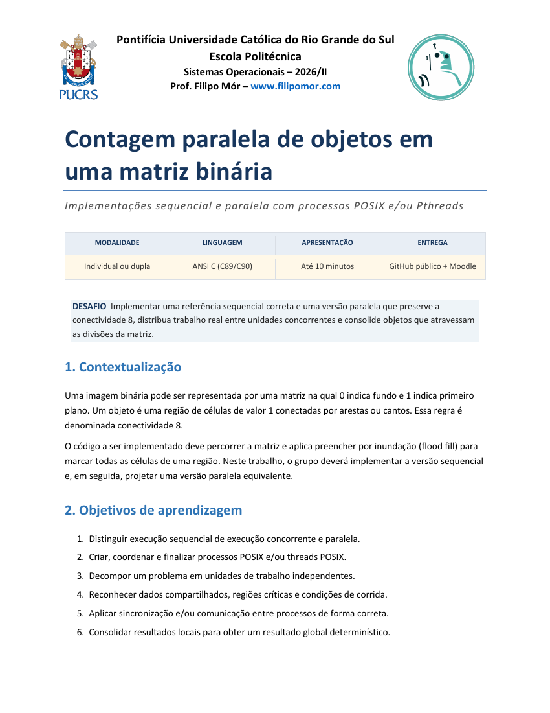
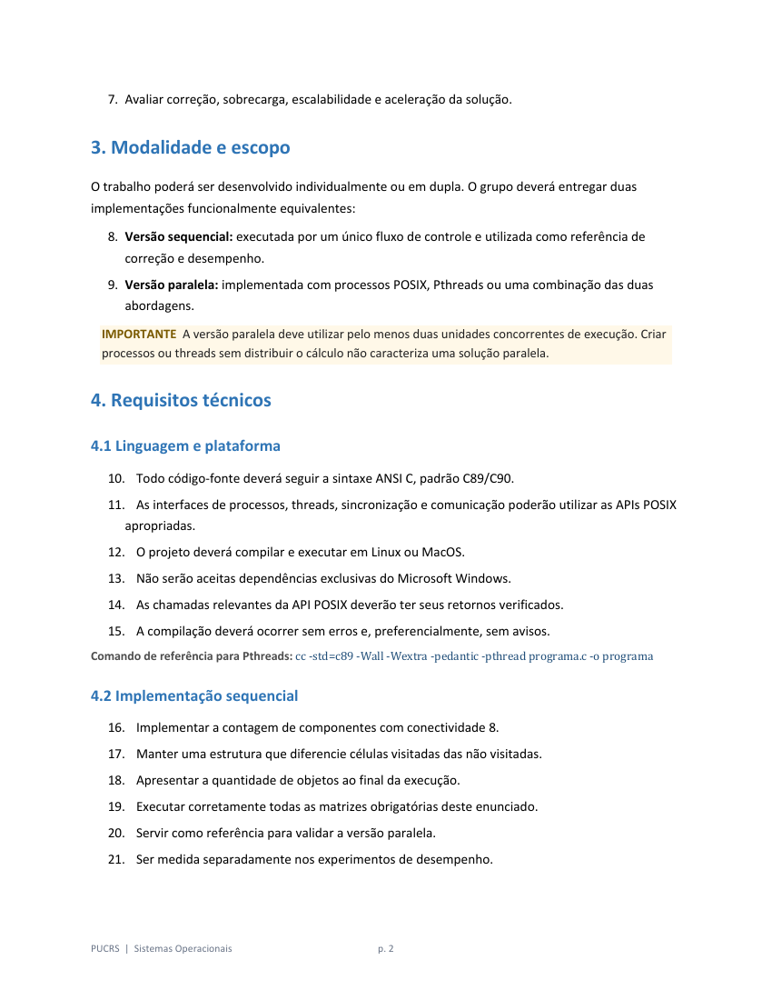
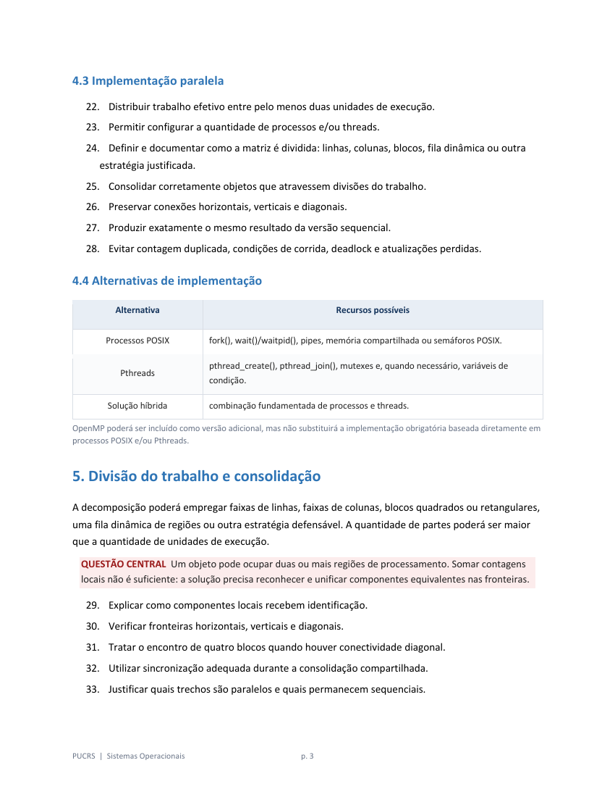
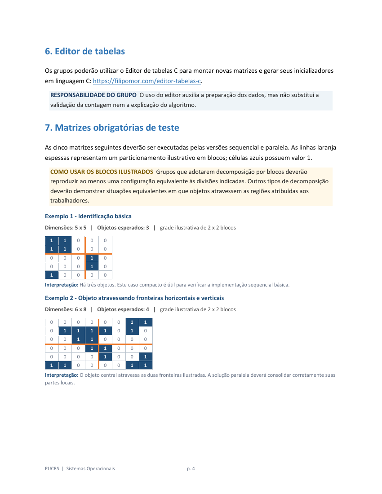
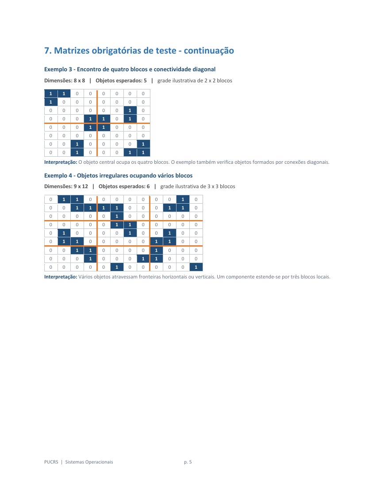
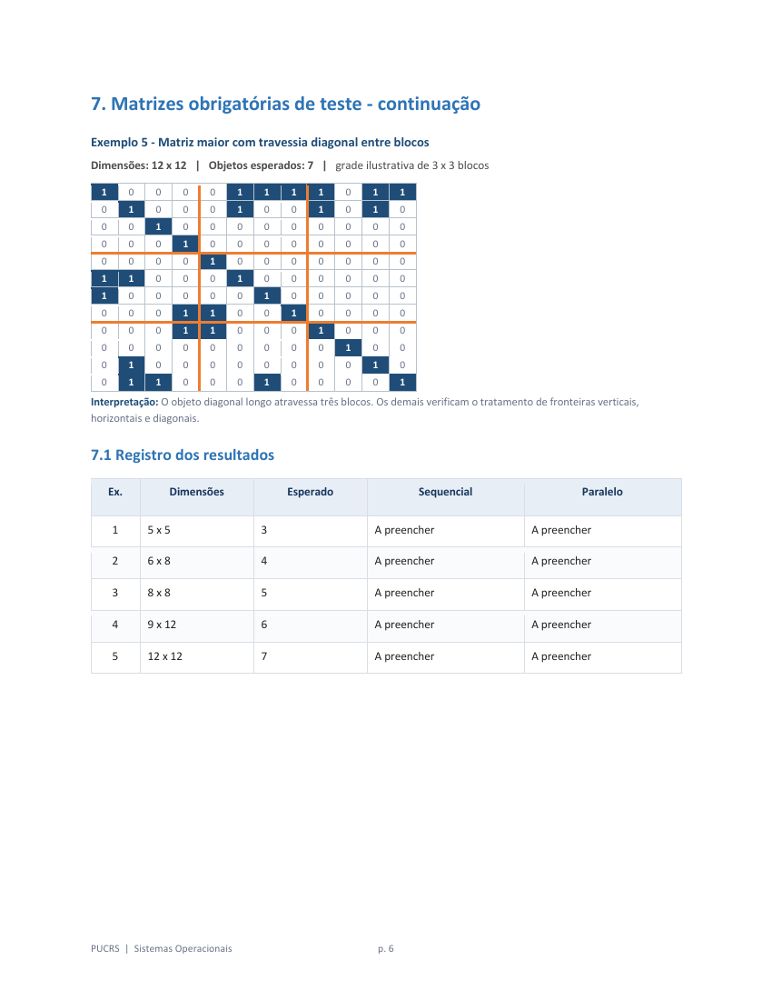
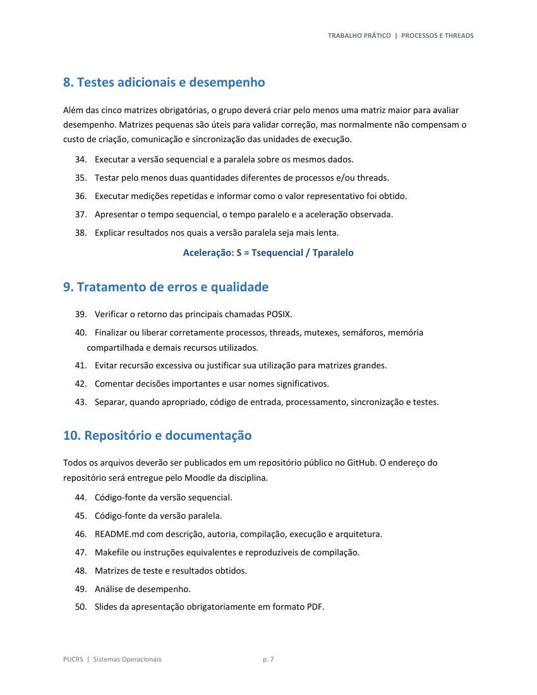
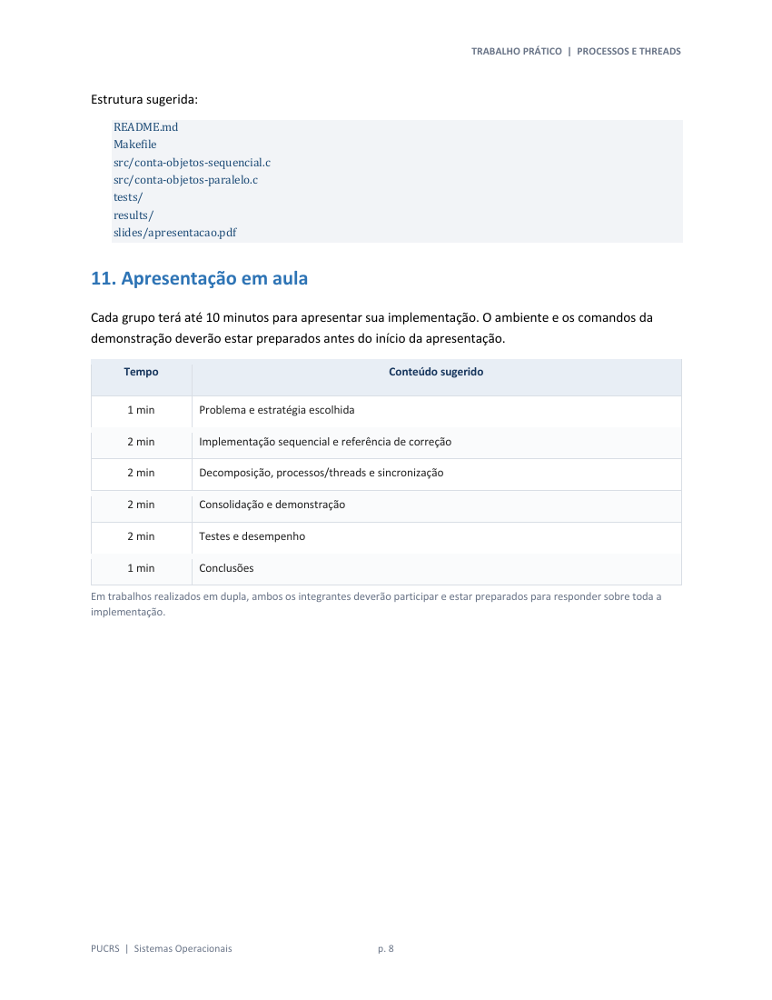
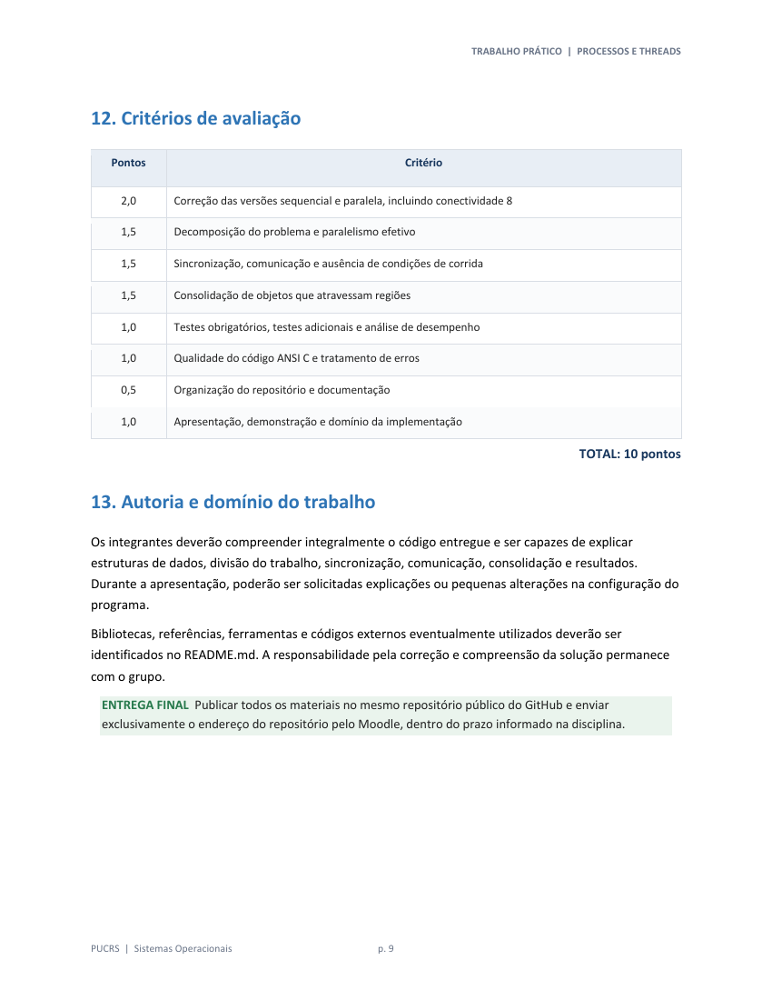

# Trabalho_Pratico_Processos_Threads_Contagem_Objetos.pdf

Fonte: [PDF original](../Trabalho_Pratico_Processos_Threads_Contagem_Objetos.pdf)\
SHA-256: `24255f84009f9922c9086d61d4ba42c00864e186d54e8791d2baa780b4ee905b`

## Página 1



```text
Pontifícia Universidade Católica do Rio Grande do Sul
                               Escola Politécnica
                             Sistemas Operacionais – 2026/II
                          Prof. Filipo Mór – www.filipomor.com


Contagem paralela de objetos em
uma matriz binária
Implementações sequencial e paralela com processos POSIX e/ou Pthreads


       MODALIDADE                 LINGUAGEM                APRESENTAÇÃO                  ENTREGA


    Individual ou dupla        ANSI C (C89/C90)            Até 10 minutos         GitHub público + Moodle


 DESAFIO Implementar uma referência sequencial correta e uma versão paralela que preserve a
 conectividade 8, distribua trabalho real entre unidades concorrentes e consolide objetos que atravessam
 as divisões da matriz.


1. Contextualização
Uma imagem binária pode ser representada por uma matriz na qual 0 indica fundo e 1 indica primeiro
plano. Um objeto é uma região de células de valor 1 conectadas por arestas ou cantos. Essa regra é
denominada conectividade 8.

O código a ser implementado deve percorrer a matriz e aplica preencher por inundação (flood fill) para
marcar todas as células de uma região. Neste trabalho, o grupo deverá implementar a versão sequencial
e, em seguida, projetar uma versão paralela equivalente.


2. Objetivos de aprendizagem
  1. Distinguir execução sequencial de execução concorrente e paralela.
  2. Criar, coordenar e finalizar processos POSIX e/ou threads POSIX.
  3. Decompor um problema em unidades de trabalho independentes.
  4. Reconhecer dados compartilhados, regiões críticas e condições de corrida.
  5. Aplicar sincronização e/ou comunicação entre processos de forma correta.
  6. Consolidar resultados locais para obter um resultado global determinístico.
```

## Página 2



```text
7. Avaliar correção, sobrecarga, escalabilidade e aceleração da solução.


3. Modalidade e escopo
O trabalho poderá ser desenvolvido individualmente ou em dupla. O grupo deverá entregar duas
implementações funcionalmente equivalentes:

   8. Versão sequencial: executada por um único fluxo de controle e utilizada como referência de
      correção e desempenho.
   9. Versão paralela: implementada com processos POSIX, Pthreads ou uma combinação das duas
      abordagens.
  IMPORTANTE A versão paralela deve utilizar pelo menos duas unidades concorrentes de execução. Criar
  processos ou threads sem distribuir o cálculo não caracteriza uma solução paralela.


4. Requisitos técnicos

4.1 Linguagem e plataforma
   10. Todo código-fonte deverá seguir a sintaxe ANSI C, padrão C89/C90.
   11. As interfaces de processos, threads, sincronização e comunicação poderão utilizar as APIs POSIX
      apropriadas.
   12. O projeto deverá compilar e executar em Linux ou MacOS.
   13. Não serão aceitas dependências exclusivas do Microsoft Windows.
   14. As chamadas relevantes da API POSIX deverão ter seus retornos verificados.
   15. A compilação deverá ocorrer sem erros e, preferencialmente, sem avisos.
Comando de referência para Pthreads: cc -std=c89 -Wall -Wextra -pedantic -pthread programa.c -o programa


4.2 Implementação sequencial
   16. Implementar a contagem de componentes com conectividade 8.
   17. Manter uma estrutura que diferencie células visitadas das não visitadas.
   18. Apresentar a quantidade de objetos ao final da execução.
   19. Executar corretamente todas as matrizes obrigatórias deste enunciado.
   20. Servir como referência para validar a versão paralela.
   21. Ser medida separadamente nos experimentos de desempenho.


PUCRS | Sistemas Operacionais                        p. 2
```

## Página 3



```text
4.3 Implementação paralela
   22. Distribuir trabalho efetivo entre pelo menos duas unidades de execução.
   23. Permitir configurar a quantidade de processos e/ou threads.
   24. Definir e documentar como a matriz é dividida: linhas, colunas, blocos, fila dinâmica ou outra
      estratégia justificada.
   25. Consolidar corretamente objetos que atravessem divisões do trabalho.
   26. Preservar conexões horizontais, verticais e diagonais.
   27. Produzir exatamente o mesmo resultado da versão sequencial.
   28. Evitar contagem duplicada, condições de corrida, deadlock e atualizações perdidas.

4.4 Alternativas de implementação

           Alternativa                                             Recursos possíveis


        Processos POSIX            fork(), wait()/waitpid(), pipes, memória compartilhada ou semáforos POSIX.

                                   pthread_create(), pthread_join(), mutexes e, quando necessário, variáveis de
            Pthreads
                                   condição.

         Solução híbrida           combinação fundamentada de processos e threads.

OpenMP poderá ser incluído como versão adicional, mas não substituirá a implementação obrigatória baseada diretamente em
processos POSIX e/ou Pthreads.


5. Divisão do trabalho e consolidação
A decomposição poderá empregar faixas de linhas, faixas de colunas, blocos quadrados ou retangulares,
uma fila dinâmica de regiões ou outra estratégia defensável. A quantidade de partes poderá ser maior
que a quantidade de unidades de execução.

  QUESTÃO CENTRAL Um objeto pode ocupar duas ou mais regiões de processamento. Somar contagens
  locais não é suficiente: a solução precisa reconhecer e unificar componentes equivalentes nas fronteiras.

   29. Explicar como componentes locais recebem identificação.
   30. Verificar fronteiras horizontais, verticais e diagonais.
   31. Tratar o encontro de quatro blocos quando houver conectividade diagonal.
   32. Utilizar sincronização adequada durante a consolidação compartilhada.
   33. Justificar quais trechos são paralelos e quais permanecem sequenciais.


PUCRS | Sistemas Operacionais                             p. 3
```

## Página 4



```text
6. Editor de tabelas
Os grupos poderão utilizar o Editor de tabelas C para montar novas matrizes e gerar seus inicializadores
em linguagem C: https://filipomor.com/editor-tabelas-c.

  RESPONSABILIDADE DO GRUPO O uso do editor auxilia a preparação dos dados, mas não substitui a
  validação da contagem nem a explicação do algoritmo.


7. Matrizes obrigatórias de teste
As cinco matrizes seguintes deverão ser executadas pelas versões sequencial e paralela. As linhas laranja
espessas representam um particionamento ilustrativo em blocos; células azuis possuem valor 1.

  COMO USAR OS BLOCOS ILUSTRADOS Grupos que adotarem decomposição por blocos deverão
  reproduzir ao menos uma configuração equivalente às divisões indicadas. Outros tipos de decomposição
  deverão demonstrar situações equivalentes em que objetos atravessem as regiões atribuídas aos
  trabalhadores.

Exemplo 1 - Identificação básica
Dimensões: 5 x 5 | Objetos esperados: 3 | grade ilustrativa de 2 x 2 blocos

  1     1     0    0     0
  1     1     0    0     0
  0     0     0    1     0
  0     0     0    1     0
  1     0     0    0     0
Interpretação: Há três objetos. Este caso compacto é útil para verificar a implementação sequencial básica.

Exemplo 2 - Objeto atravessando fronteiras horizontais e verticais
Dimensões: 6 x 8 | Objetos esperados: 4 | grade ilustrativa de 2 x 2 blocos

  0     0     0    0     0      0    1     1
  0     1     1    1     1      0    1     0
  0     0     1    1     0      0    0     0
  0     0     0    1     1      0    0     0
  0     0     0    0     1      0    0     1
  1     1     0    0     0      0    1     1
Interpretação: O objeto central atravessa as duas fronteiras ilustradas. A solução paralela deverá consolidar corretamente suas
partes locais.


PUCRS | Sistemas Operacionais                                 p. 4
```

## Página 5



```text
7. Matrizes obrigatórias de teste - continuação
Exemplo 3 - Encontro de quatro blocos e conectividade diagonal
Dimensões: 8 x 8 | Objetos esperados: 5 | grade ilustrativa de 2 x 2 blocos

  1     1    0     0     0      0    0     0
  1     0    0     0     0      0    0     0
  0     0    0     0     0      0    1     0
  0     0    0     1     1      0    1     0
  0     0    0     1     1      0    0     0
  0     0    0     0     0      0    0     0
  0     0    1     0     0      0    0     1
  0     0    1     0     0      0    1     1
Interpretação: O objeto central ocupa os quatro blocos. O exemplo também verifica objetos formados por conexões diagonais.

Exemplo 4 - Objetos irregulares ocupando vários blocos
Dimensões: 9 x 12 | Objetos esperados: 6 | grade ilustrativa de 3 x 3 blocos

  0     1    1     0     0      0    0     0    0     0     1       0
  0     0    1     1     1      1    0     0    0     1     1       0
  0     0    0     0     0      1    0     0    0     0     0       0
  0     0    0     0     0      1    1     0    0     0     0       0
  0     1    0     0     0      0    1     0    0     1     0       0
  0     1    1     0     0      0    0     0    1     1     0       0
  0     0    1     1     0      0    0     0    1     0     0       0
  0     0    0     1     0      0    0     1    1     0     0       0
  0     0    0     0     0      1    0     0    0     0     0       1
Interpretação: Vários objetos atravessam fronteiras horizontais ou verticais. Um componente estende-se por três blocos locais.


PUCRS | Sistemas Operacionais                                p. 5
```

## Página 6



```text
7. Matrizes obrigatórias de teste - continuação
Exemplo 5 - Matriz maior com travessia diagonal entre blocos
Dimensões: 12 x 12 | Objetos esperados: 7 | grade ilustrativa de 3 x 3 blocos

  1         0    0        0   0   1   1    1     1     0     1       1
  0         1    0        0   0   1   0    0     1     0     1       0
  0         0    1        0   0   0   0    0     0     0     0       0
  0         0    0        1   0   0   0    0     0     0     0       0
  0         0    0        0   1   0   0    0     0     0     0       0
  1         1    0        0   0   1   0    0     0     0     0       0
  1         0    0        0   0   0   1    0     0     0     0       0
  0         0    0        1   1   0   0    1     0     0     0       0
  0         0    0        1   1   0   0    0     1     0     0       0
  0         0    0        0   0   0   0    0     0     1     0       0
  0         1    0        0   0   0   0    0     0     0     1       0
  0         1    1        0   0   0   1    0     0     0     0       1
Interpretação: O objeto diagonal longo atravessa três blocos. Os demais verificam o tratamento de fronteiras verticais,
horizontais e diagonais.


7.1 Registro dos resultados

      Ex.            Dimensões            Esperado                       Sequencial                       Paralelo


      1         5x5                   3                      A preencher                       A preencher

      2         6x8                   4                      A preencher                       A preencher

      3         8x8                   5                      A preencher                       A preencher

      4         9 x 12                6                      A preencher                       A preencher

      5         12 x 12               7                      A preencher                       A preencher


PUCRS | Sistemas Operacionais                                 p. 6
```

## Página 7



```text
TRABALHO PRÁTICO | PROCESSOS E THREADS


8. Testes adicionais e desempenho
Além das cinco matrizes obrigatórias, o grupo deverá criar pelo menos uma matriz maior para avaliar
desempenho. Matrizes pequenas são úteis para validar correção, mas normalmente não compensam o
custo de criação, comunicação e sincronização das unidades de execução.

   34. Executar a versão sequencial e a paralela sobre os mesmos dados.
   35. Testar pelo menos duas quantidades diferentes de processos e/ou threads.
   36. Executar medições repetidas e informar como o valor representativo foi obtido.
   37. Apresentar o tempo sequencial, o tempo paralelo e a aceleração observada.
   38. Explicar resultados nos quais a versão paralela seja mais lenta.

                                Aceleração: S = Tsequencial / Tparalelo


9. Tratamento de erros e qualidade
   39. Verificar o retorno das principais chamadas POSIX.
   40. Finalizar ou liberar corretamente processos, threads, mutexes, semáforos, memória
      compartilhada e demais recursos utilizados.
   41. Evitar recursão excessiva ou justificar sua utilização para matrizes grandes.
   42. Comentar decisões importantes e usar nomes significativos.
   43. Separar, quando apropriado, código de entrada, processamento, sincronização e testes.


10. Repositório e documentação
Todos os arquivos deverão ser publicados em um repositório público no GitHub. O endereço do
repositório será entregue pelo Moodle da disciplina.

   44. Código-fonte da versão sequencial.
   45. Código-fonte da versão paralela.
   46. README.md com descrição, autoria, compilação, execução e arquitetura.
   47. Makefile ou instruções equivalentes e reproduzíveis de compilação.
   48. Matrizes de teste e resultados obtidos.
   49. Análise de desempenho.
   50. Slides da apresentação obrigatoriamente em formato PDF.


PUCRS | Sistemas Operacionais                       p. 7
```

## Página 8



```text
TRABALHO PRÁTICO | PROCESSOS E THREADS


Estrutura sugerida:
    README.md
    Makefile
    src/conta-objetos-sequencial.c
    src/conta-objetos-paralelo.c
    tests/
    results/
    slides/apresentacao.pdf


11. Apresentação em aula
Cada grupo terá até 10 minutos para apresentar sua implementação. O ambiente e os comandos da
demonstração deverão estar preparados antes do início da apresentação.

      Tempo                                                   Conteúdo sugerido


       1 min          Problema e estratégia escolhida

       2 min          Implementação sequencial e referência de correção

       2 min          Decomposição, processos/threads e sincronização

       2 min          Consolidação e demonstração

       2 min          Testes e desempenho

       1 min          Conclusões

Em trabalhos realizados em dupla, ambos os integrantes deverão participar e estar preparados para responder sobre toda a
implementação.


PUCRS | Sistemas Operacionais                               p. 8
```

## Página 9



```text
TRABALHO PRÁTICO | PROCESSOS E THREADS


12. Critérios de avaliação

    Pontos                                                       Critério


      2,0        Correção das versões sequencial e paralela, incluindo conectividade 8

      1,5        Decomposição do problema e paralelismo efetivo

      1,5        Sincronização, comunicação e ausência de condições de corrida

      1,5        Consolidação de objetos que atravessam regiões

      1,0        Testes obrigatórios, testes adicionais e análise de desempenho

      1,0        Qualidade do código ANSI C e tratamento de erros

      0,5        Organização do repositório e documentação

      1,0        Apresentação, demonstração e domínio da implementação

                                                                                                TOTAL: 10 pontos


13. Autoria e domínio do trabalho
Os integrantes deverão compreender integralmente o código entregue e ser capazes de explicar
estruturas de dados, divisão do trabalho, sincronização, comunicação, consolidação e resultados.
Durante a apresentação, poderão ser solicitadas explicações ou pequenas alterações na configuração do
programa.

Bibliotecas, referências, ferramentas e códigos externos eventualmente utilizados deverão ser
identificados no README.md. A responsabilidade pela correção e compreensão da solução permanece
com o grupo.

  ENTREGA FINAL Publicar todos os materiais no mesmo repositório público do GitHub e enviar
  exclusivamente o endereço do repositório pelo Moodle, dentro do prazo informado na disciplina.


PUCRS | Sistemas Operacionais                             p. 9
```

## Complemento visual — matrizes das páginas 4–6

Nota editorial: transcrição existente no README, conferida nesta extração contra as páginas renderizadas. As divisões são ilustrativas; os valores esperados pertencem ao enunciado e não foram recalculados.

### Exemplo 1 - Identificação básica

*Fonte: página 4.*

**Dimensões:** 5 x 5 | **Objetos esperados:** 3 | **Grade ilustrativa:** 2 x 2 blocos

Divisões ilustradas: após a linha 2 e a coluna 3.

```text
1 1 0 | 0 0
1 1 0 | 0 0
------+----
0 0 0 | 1 0
0 0 0 | 1 0
1 0 0 | 0 0
```

**Interpretação:** Há três objetos. Este caso compacto é útil para verificar a implementação sequencial básica.

### Exemplo 2 - Objeto atravessando fronteiras horizontais e verticais

*Fonte: página 4.*

**Dimensões:** 6 x 8 | **Objetos esperados:** 4 | **Grade ilustrativa:** 2 x 2 blocos

Divisões ilustradas: após a linha 3 e a coluna 4.

```text
0 0 0 0 | 0 0 1 1
0 1 1 1 | 1 0 1 0
0 0 1 1 | 0 0 0 0
--------+--------
0 0 0 1 | 1 0 0 0
0 0 0 0 | 1 0 0 1
1 1 0 0 | 0 0 1 1
```

**Interpretação:** O objeto central atravessa as duas fronteiras ilustradas. A solução paralela deverá consolidar corretamente suas partes locais.

### Exemplo 3 - Encontro de quatro blocos e conectividade diagonal

*Fonte: página 5.*

**Dimensões:** 8 x 8 | **Objetos esperados:** 5 | **Grade ilustrativa:** 2 x 2 blocos

Divisões ilustradas: após a linha 4 e a coluna 4.

```text
1 1 0 0 | 0 0 0 0
1 0 0 0 | 0 0 0 0
0 0 0 0 | 0 0 1 0
0 0 0 1 | 1 0 1 0
--------+--------
0 0 0 1 | 1 0 0 0
0 0 0 0 | 0 0 0 0
0 0 1 0 | 0 0 0 1
0 0 1 0 | 0 0 1 1
```

**Interpretação:** O objeto central ocupa os quatro blocos. O exemplo também verifica objetos formados por conexões diagonais.

### Exemplo 4 - Objetos irregulares ocupando vários blocos

*Fonte: página 5.*

**Dimensões:** 9 x 12 | **Objetos esperados:** 6 | **Grade ilustrativa:** 3 x 3 blocos

Divisões ilustradas: após as linhas 3 e 6 e as colunas 4 e 8.

```text
0 1 1 0 | 0 0 0 0 | 0 0 1 0
0 0 1 1 | 1 1 0 0 | 0 1 1 0
0 0 0 0 | 0 1 0 0 | 0 0 0 0
--------+---------+--------
0 0 0 0 | 0 1 1 0 | 0 0 0 0
0 1 0 0 | 0 0 1 0 | 0 1 0 0
0 1 1 0 | 0 0 0 0 | 1 1 0 0
--------+---------+--------
0 0 1 1 | 0 0 0 0 | 1 0 0 0
0 0 0 1 | 0 0 0 1 | 1 0 0 0
0 0 0 0 | 0 1 0 0 | 0 0 0 1
```

**Interpretação:** Vários objetos atravessam fronteiras horizontais ou verticais. Um componente estende-se por três blocos locais.

### Exemplo 5 - Matriz maior com travessia diagonal entre blocos

*Fonte: página 6.*

**Dimensões:** 12 x 12 | **Objetos esperados:** 7 | **Grade ilustrativa:** 3 x 3 blocos

Divisões ilustradas: após as linhas 4 e 8 e as colunas 4 e 8.

```text
1 0 0 0 | 0 1 1 1 | 1 0 1 1
0 1 0 0 | 0 1 0 0 | 1 0 1 0
0 0 1 0 | 0 0 0 0 | 0 0 0 0
0 0 0 1 | 0 0 0 0 | 0 0 0 0
--------+---------+--------
0 0 0 0 | 1 0 0 0 | 0 0 0 0
1 1 0 0 | 0 1 0 0 | 0 0 0 0
1 0 0 0 | 0 0 1 0 | 0 0 0 0
0 0 0 1 | 1 0 0 1 | 0 0 0 0
--------+---------+--------
0 0 0 1 | 1 0 0 0 | 1 0 0 0
0 0 0 0 | 0 0 0 0 | 0 1 0 0
0 1 0 0 | 0 0 0 0 | 0 0 1 0
0 1 1 0 | 0 0 1 0 | 0 0 0 1
```

**Interpretação:** O objeto diagonal longo atravessa três blocos. Os demais verificam o tratamento de fronteiras verticais, horizontais e diagonais.

### 7.1 Registro dos resultados

*Fonte: página 6.*

| Ex. | Dimensões | Esperado | Sequencial | Paralelo |
| --- | --- | --- | --- | --- |
| 1 | 5 x 5 | 3 | A preencher | A preencher |
| 2 | 6 x 8 | 4 | A preencher | A preencher |
| 3 | 8 x 8 | 5 | A preencher | A preencher |
| 4 | 9 x 12 | 6 | A preencher | A preencher |
| 5 | 12 x 12 | 7 | A preencher | A preencher |

