# [SisOp]_Processos_e_Threads_em_Sistemas_Operacionais_POSIX.pdf

Fonte: [PDF original](../%5BSisOp%5D_Processos_e_Threads_em_Sistemas_Operacionais_POSIX.pdf)\
SHA-256: `31ba933136a064494119ac5e292b98c0568f67441f5d493eb76bfa3df52f36f1`

## Página 1

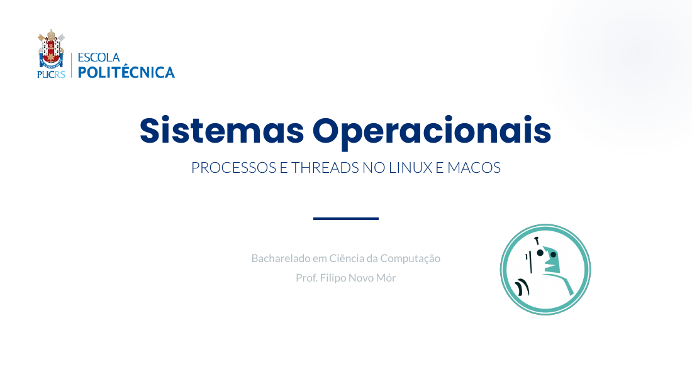

```text
Sistemas Operacionais
  PROCESSOS E THREADS NO LINUX E MACOS


         Bacharelado em Ciência da Computação
                 Prof. Filipo Novo Mór
```

## Página 2


```text
AGENDA DA AULA


Bloco 1: Processos                 Bloco 2: Threads
 • Conceito e Memória               • Modelo Lightweight Process
 • O PCB (Process Control Block)    • O padrão POSIX (pthreads)
 • Criação via syscall fork()       • Comunicação e Mutex
```

## Página 3

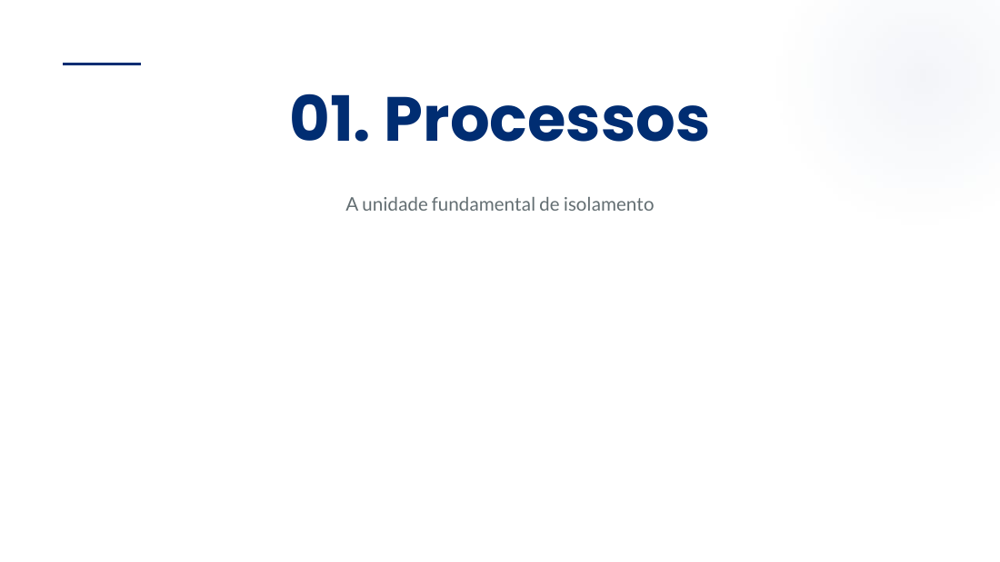

```text
01. Processos
 A unidade fundamental de isolamento
```

## Página 4

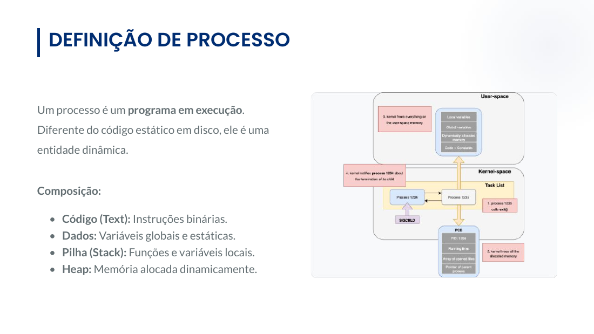

```text
DEFINIÇÃO DE PROCESSO


Um processo é um programa em execução.
Diferente do código estático em disco, ele é uma
entidade dinâmica.


Composição:

  • Código (Text): Instruções binárias.
  • Dados: Variáveis globais e estáticas.
  • Pilha (Stack): Funções e variáveis locais.
  • Heap: Memória alocada dinamicamente.
```

## Página 5

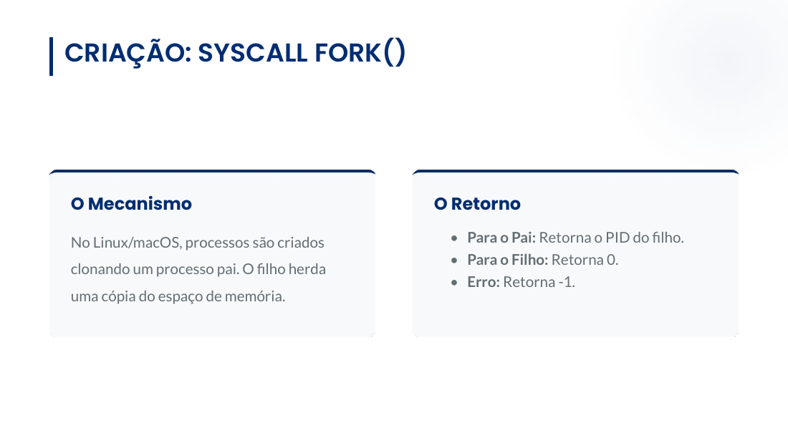

```text
CRIAÇÃO: SYSCALL FORK()


O Mecanismo                              O Retorno

No Linux/macOS, processos são criados     • Para o Pai: Retorna o PID do filho.
                                          • Para o Filho: Retorna 0.
clonando um processo pai. O filho herda
                                          • Erro: Retorna -1.
uma cópia do espaço de memória.
```

## Página 6

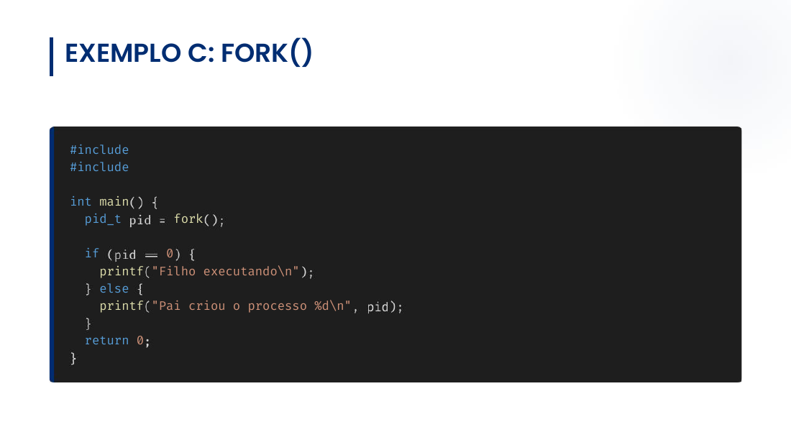

```text
EXEMPLO C: FORK()


#include
#include

int main
  pid_t       fork

  if         0
    printf "Filho executando\n"
    else
    printf "Pai criou o processo %d\n"

  return 0
```

## Página 7

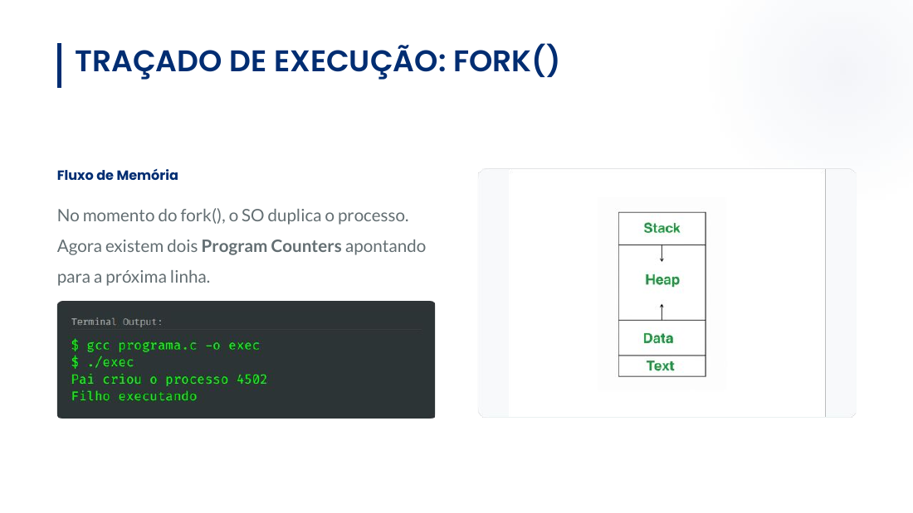

```text
TRAÇADO DE EXECUÇÃO: FORK()


Fluxo de Memória


No momento do fork(), o SO duplica o processo.
Agora existem dois Program Counters apontando
para a próxima linha.
```

## Página 8


```text
02. Threads
Concorrência dentro do mesmo espaço
```

## Página 9


```text
CONCEITO DE THREAD


"Lightweight Process"                     O que é compartilhado?

Uma thread é um fluxo de execução dentro    • Segmento de Código e Dados (Globais).
de um processo. Enquanto processos são     • Arquivos abertos e Sinais.
                                           • Privado: Cada thread tem seu Stack e
isolados, threads compartilham a mesma
                                             Registradores.
memória.
```

## Página 10

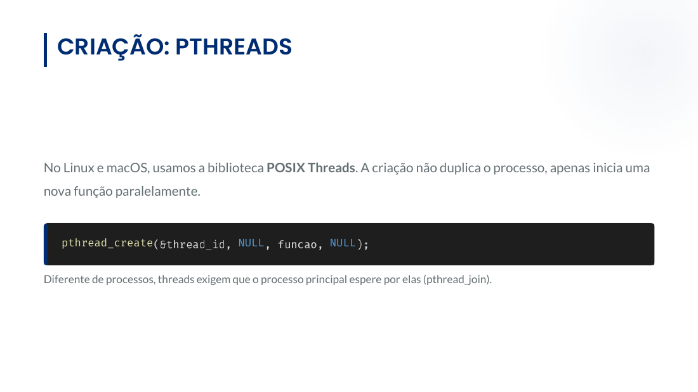

```text
CRIAÇÃO: PTHREADS


No Linux e macOS, usamos a biblioteca POSIX Threads. A criação não duplica o processo, apenas inicia uma
nova função paralelamente.


   pthread_create                        NULL               NULL


Diferente de processos, threads exigem que o processo principal espere por elas (pthread_join).
```

## Página 11

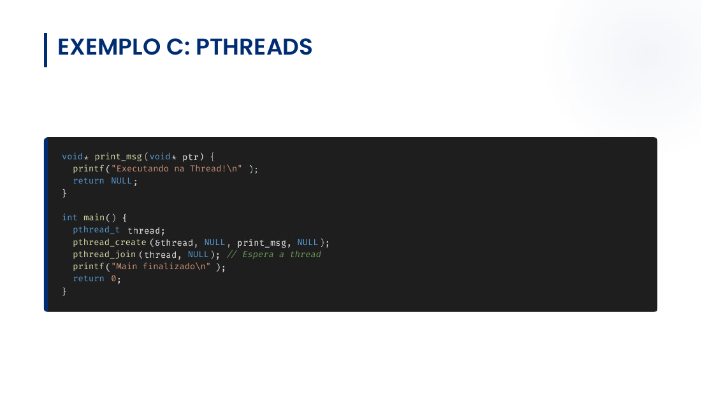

```text
EXEMPLO C: PTHREADS


void print_msg void
  printf "Executando na Thread!\n"
  return NULL


int main
  pthread_t
  pthread_create           NULL               NULL
  pthread_join          NULL    // Espera a thread
  printf "Main finalizado\n"
  return 0
```

## Página 12

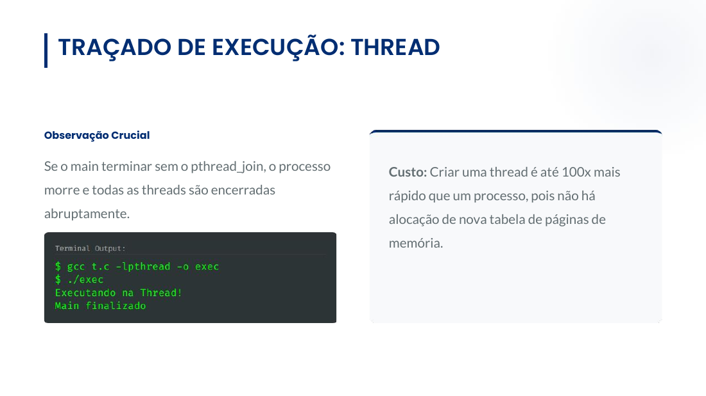

```text
TRAÇADO DE EXECUÇÃO: THREAD


Observação Crucial


Se o main terminar sem o pthread_join, o processo   Custo: Criar uma thread é até 100x mais
morre e todas as threads são encerradas             rápido que um processo, pois não há
abruptamente.                                       alocação de nova tabela de páginas de
                                                    memória.
```

## Página 13

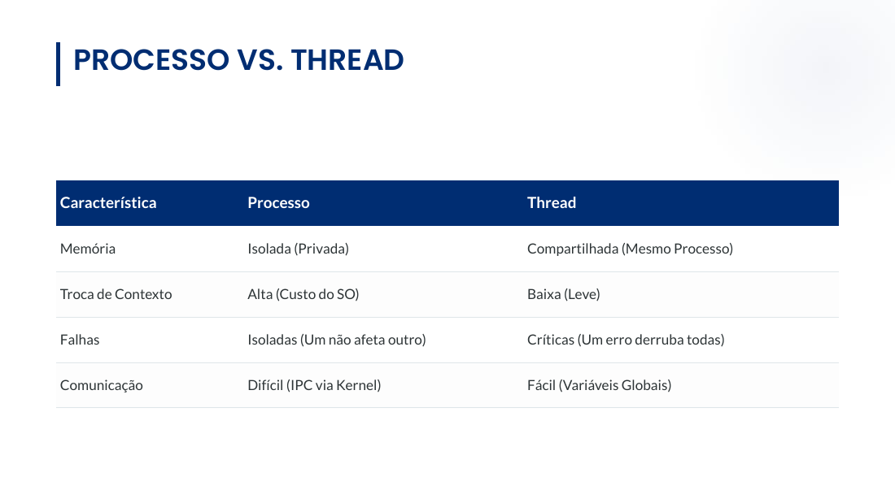

```text
PROCESSO VS. THREAD


Característica      Processo                        Thread

Memória             Isolada (Privada)               Compartilhada (Mesmo Processo)


Troca de Contexto   Alta (Custo do SO)              Baixa (Leve)


Falhas              Isoladas (Um não afeta outro)   Críticas (Um erro derruba todas)


Comunicação         Difícil (IPC via Kernel)        Fácil (Variáveis Globais)
```

## Página 14


```text
IPC: INTER-PROCESS COMMUNICATION


Como processos não acessam a memória uns dos outros, o Kernel atua como mediador através de IPC.


             Pipes                           Shared Mem                          Messages


  Fluxo unidirecional de bytes.       Área de memória mapeada          Fila de mensagens via Kernel.
                                             em ambos.
```

## Página 15

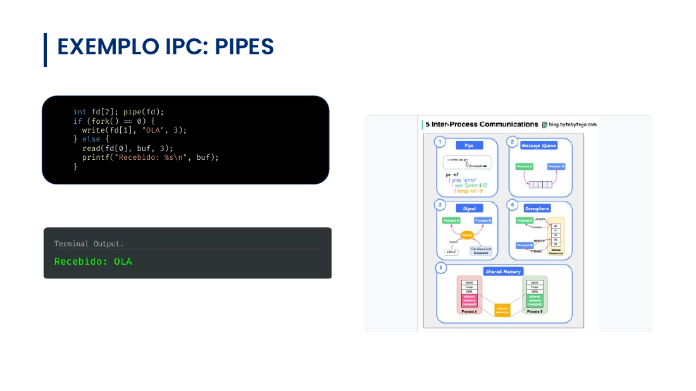

```text
EXEMPLO IPC: PIPES

 int fd[2]; pipe(fd);
 if (fork() == 0) {
   write(fd[1], "OLA", 3);
 } else {
   read(fd[0], buf, 3);
   printf("Recebido: %s\n", buf);
 }
```

## Página 16

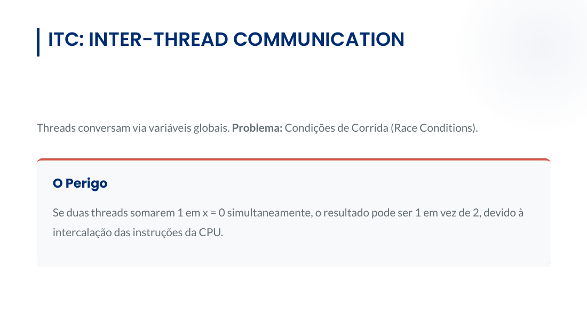

```text
ITC: INTER-THREAD COMMUNICATION


Threads conversam via variáveis globais. Problema: Condições de Corrida (Race Conditions).


   O Perigo

   Se duas threads somarem 1 em x = 0 simultaneamente, o resultado pode ser 1 em vez de 2, devido à
   intercalação das instruções da CPU.
```

## Página 17

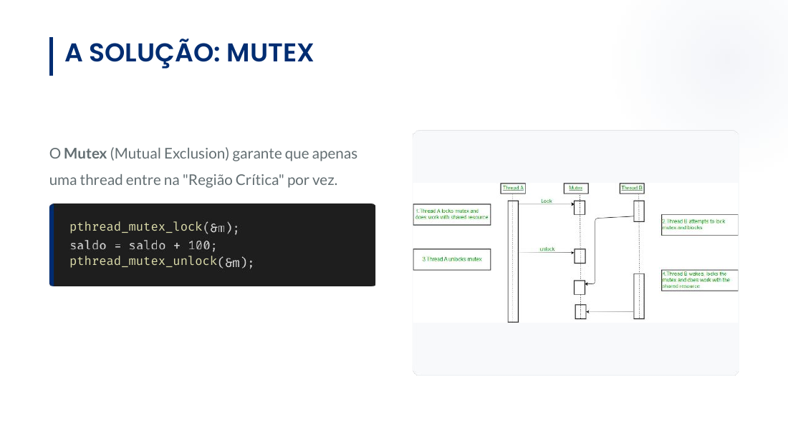

```text
A SOLUÇÃO: MUTEX


O Mutex (Mutual Exclusion) garante que apenas
uma thread entre na "Região Crítica" por vez.


   pthread_mutex_lock

   pthread_mutex_unlock
```

## Página 18

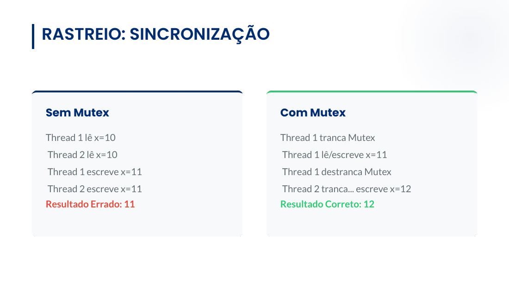

```text
RASTREIO: SINCRONIZAÇÃO


Sem Mutex                 Com Mutex

Thread 1 lê x=10          Thread 1 tranca Mutex
Thread 2 lê x=10          Thread 1 lê/escreve x=11
Thread 1 escreve x=11     Thread 1 destranca Mutex
Thread 2 escreve x=11     Thread 2 tranca... escreve x=12
Resultado Errado: 11      Resultado Correto: 12
```

## Página 19

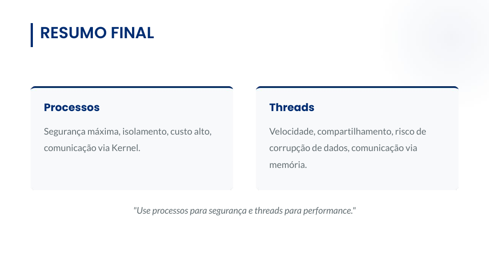

```text
RESUMO FINAL


Processos                                               Threads

Segurança máxima, isolamento, custo alto,               Velocidade, compartilhamento, risco de
comunicação via Kernel.                                 corrupção de dados, comunicação via
                                                        memória.


                     "Use processos para segurança e threads para performance."
```

## Página 20


```text
Dúvidas?
Sistemas Operacionais | Ciência da Computação


        Bacharelado em Ciência da Computação
                Prof. Filipo Novo Mór
```

## Página 21

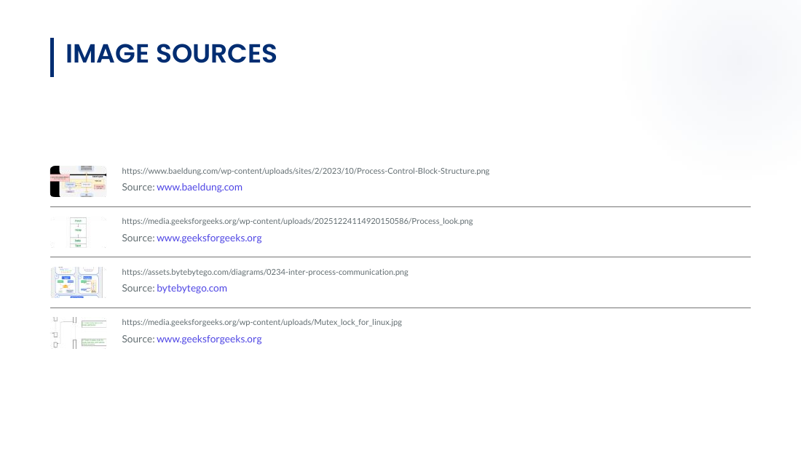

```text
IMAGE SOURCES


   https://www.baeldung.com/wp-content/uploads/sites/2/2023/10/Process-Control-Block-Structure.png

   Source: www.baeldung.com


   https://media.geeksforgeeks.org/wp-content/uploads/20251224114920150586/Process_look.png

   Source: www.geeksforgeeks.org


   https://assets.bytebytego.com/diagrams/0234-inter-process-communication.png

   Source: bytebytego.com


   https://media.geeksforgeeks.org/wp-content/uploads/Mutex_lock_for_linux.jpg

   Source: www.geeksforgeeks.org
```

## Nota editorial sobre conteúdo gráfico

As figuras das páginas 4, 7, 15 e 17 contêm conteúdo rasterizado que não aparece integralmente no texto automático. As imagens de todas as páginas estão preservadas acima. Há uma transcrição anterior dos rótulos em [reference.md](../../docs/reference.md); nesta execução não se certificou cada rótulo pequeno desses diagramas. No slide 6, as linhas `#include` não apresentam cabeçalhos no próprio original; a lacuna foi mantida.
